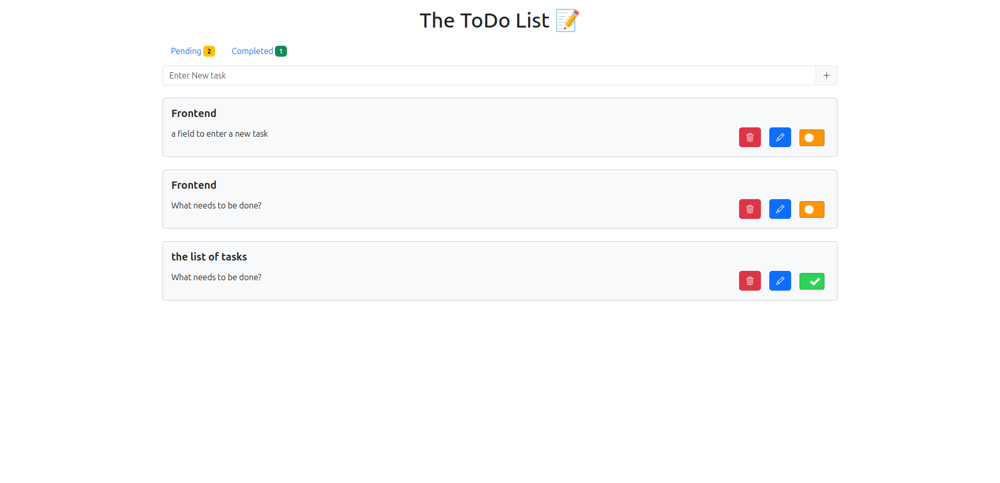

# The ToDo list 📝

## Features

- Create a new task.
- Edit a task.
- Delete a task.
- List all tasks.
- Mark a task as completed or pending.
- Count the number of tasks completed and pending.

## Technologies

- Vue.js 3 ( Composition API )
- Bootstrap 5
- LocalStorage
- Pinia
- TypeScript

## Project setup

Clone the repository and move to the project folder

```bash
git clone git@github.com:derecklhw/todo_list.git && cd todo_list/
```

### Frontend

Move to the frontend folder

```bash
cd frontend/
```

Install the dependencies

```bash
npm install
```

### Compile and Hot-Reload for Development

```sh
npm run dev
```

### Type-Check, Compile and Minify for Production

```sh
npm run build
```

### Backend

Work in progress 😛

## Future improvements

- Add a backend to store the tasks.
- Add user authentication.
- Add a search bar to filter tasks.
- Add a date picker to set a deadline for the tasks.
- Add a priority field to the tasks.
- Add a tag field to the tasks.
- Add a filter to show only completed or pending tasks.

## Screenshots


